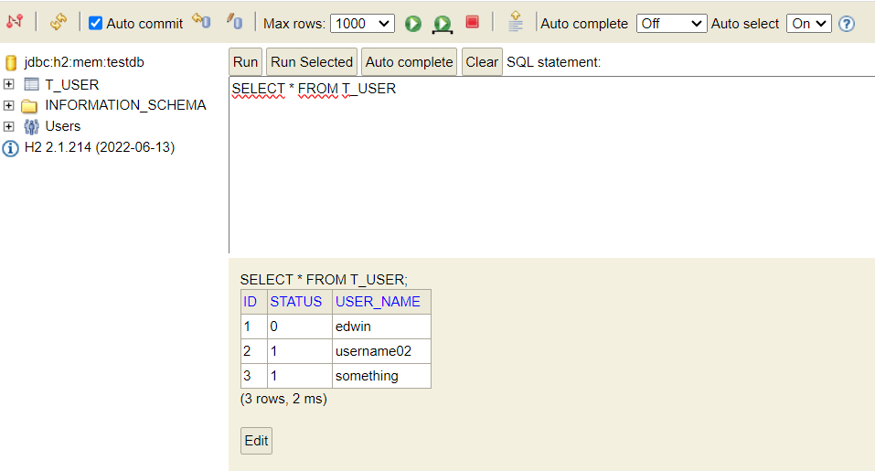

# How to Implement Soft Delete with JPA and Spring 3
We are using a field on the `T_USER` table, which is called `STATUS`. If `STATUS` is equals `1` then the user is considered `ACTIVE`, while `0` means `INACTIVE`. 

So there will be no direct `DELETE` command in application, since all deleted data will still be available on the corresponding table.

## How to Do It?
```
$ curl -kv http://localhost:8080/delete?id=1
*   Trying ::1:8080...
* TCP_NODELAY set
* Connected to localhost (::1) port 8080 (#0)
> GET /delete?id=1 HTTP/1.1
> Host: localhost:8080
> User-Agent: curl/7.65.0
> Accept: */*
>
* Mark bundle as not supporting multiuse
< HTTP/1.1 200
< Content-Type: application/json
< Transfer-Encoding: chunked
< Date: Wed, 25 Oct 2023 11:18:26 GMT
<
* Connection #0 to host localhost left intact
{"status":"success"}                                                              
```

## Result


## How to Access H2 Database
We can use below URL to display H2 dashboard,
```
http://localhost:8080/h2-console/
```